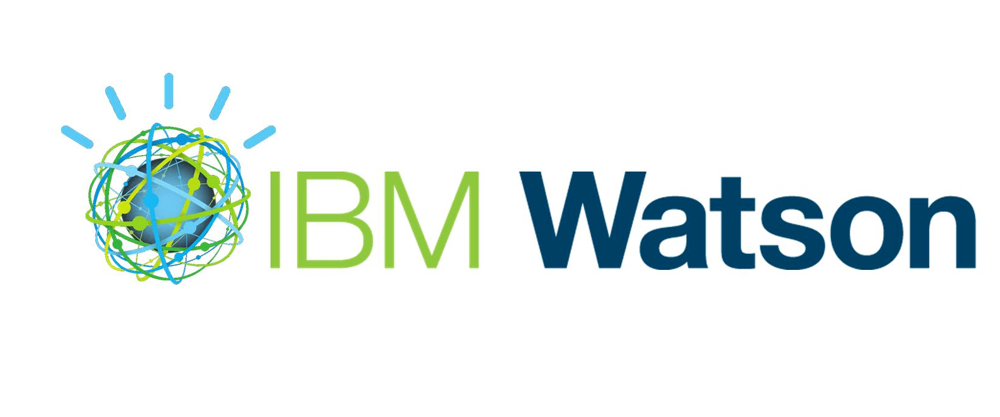

# Emily.AI
# Team-Project-14


Bruce Decker

Murtaza Manasawala

Pradnyesh Patil

Mahitee Satasiya


## Introduction 
Inspired by movie "her". We will build a conversation chatbot for people who feel lonely and depressed. This product will be a companion in daily life, which will help users with simple tasks like searching, finding out about the nearest location. Many depressed people don’t have the access to psychiatrists. Hence, they need a product that will help them express themselves. We will implement machine learning techniques that will make the chatbot smart and imitate a real human being. DialogFlow (API.AI), web-based assistant and Google Home Assistant will be used in this project. The questions and answers in DialogFlow were modeled after psychiatrists’ questions.  DialogFlow performed machine learning under the hood to make the interaction smooth and human-like. Chatbot applications will be the future of human-computer interaction. Using natural language, the interaction is faster and easy. I will continue working on this project in the future since my passion is natural language processing and deep learning. I believe advances in natural language processing will help society.  

## Solving Societal Problem 
In today's society, a percentage of the population feel lonely and depressed due to various circumstances. Many people are afraid of talking about their problems. Many refused to go to a psychologist due to cost and accessibility. Depression can cause gun violence and other crimes. 

## Implementation
Our company created an emotionally intelligent chatbot, which will help with an average user's depression. It's modeled after a lot of conversations and dialogs done by psychologists. In DialogFlow, it uses machine learning algorithm to train the bot so the conversation feels natural. 

## Our Idea 
We designed a product that is an emotionally intelligent and interactive model on which you can rely on. Our product, Emily.AI, is an intelligent bot which will serve as a companion to people who need someone to talk to. This product will be inclusive of security which can be provided to the users with respect to their chats and discussions with the bot. When the user signs up to our web site, he/she will be directed to a list of questions, which will be saved into a blockchain along with users’ written answers. Users’ written answers will be evaluated by IBM Watson personality insight, which gives accurate result about the patient's personality and other psychological traits. Since nodejs is used in this project as the backend, IBM Watson library was download via npm package manager. Since blockchain enables information to be stored securely, medical records and psychiatric evaluations must be saved in blockchain to ensure privacy and security. The blockchain was written in javascript because it will provide end points for our web application. It is also easier for front end integration. After users enter their personality information, the data was saved into blockchain and was in BlockDB after that. We also considered using Solidity for developing smart contracts. However, blockchain written in Javascript is easier for integrating with the front end code. Hence, we decided to code a blockchain in javascript. The front end was written in React. Its advantages are one-way data flow, the Virtual DOM, JSX and outstanding architecture. Apache Kafka and Redis Cache are also used in this project. Kafka can store key-value messages that come from other processes which are “producers”. Redis Cache, an in-memory data structure used as a database, stores users’ queries in this application.

## Technology Used
1. IBM Watson Personality Insights API
2. DialogFlow based machine learning model 
3. Blockchain written in Javascript
4. React
5. Node.JS
6. Kafka
7. MongoDB
8. Passport.JS
9. Brcypt Passport Encryption Module
9. Elliptic Module
10. Google Home Assistant 

## Implementation 

### IBM Watson Personality Insights



The IBM Watson Personality Insights allows developers to extract insights from various outlets like social media, enterprise data, etc. Each user has unique personality traits. This service will extract that information and do further analysis. 

In this web application, users will enter some comments that have to be longer than 100 words. This data will be passed to IBM Watson Personality API. Response from the API will be returned in JSON format, and developers can decide which information to be displayed and stored for users. The result will be based on Big5 personality test. The personality test has over 30 traits. Those traits can be self-discipline, modesty, adventurousness, and fieriness. Personality is divided into five key sections: openness, conscientiousness, extraversion, agreeableness, and emotional range [1]. The result can be astoundingly accurate. Moreover, it can be also used for analyzing personality from emails and text messages, which will be implemented in the near future. Through emails and text messages, IBM Watson will be able to capture more than 3,500 words and is going to conclude a comprehensive result about that person. 

npm package manager includes many useful libraries for web developers. One of them is IBM Watson. The command for installing IBM Watson nodejs package is,


```
npm install watson-developer-cloud
```
In addition, username, password and URLs were acquired from IBM Cloud account to for the IBM Watson API. Username and password are indispensable. After the user enters his/her comments on our website, this information will be passed to IBM Watson API in Nodejs. A JSON format response will be displayed on the console. In the future, the chatbot will be configured according to user’s personality test done by IBM Watson Personality Insights. 

### Blockchain


A blockchain is a distributed database that continuously grows in order according to demand. The most famous blockchain based services are Bitcoin and Ethereum. Not only blockchain technology can be used in finance, it can used in storing medical records in a secure and private manner. A block is the most fundamental structure of a blockchain. It includes index, timestamp, data, hash and previous block. A block class was written in Javascript in project which includes those parameters as mentioned above. 

Furthermore, a block needs to be hashed to make sure the data is secure. No one can tamper with the data in the future. In Nodejs, I used SHA-256 library to implement hashing. It is a cryptographic hash function to produce an output using input. It will be difficult to reconstruct input using output. 

In order to generate a block, the hash of the previous block must be known. The first block is always called “genesis”, and it contains no data. The integrity of the entire blockchain must be validated before creating a new block. There is only one set of blocks in the chain. If there is a conflict, the chain with the highest number of blocks is chosen. It is indispensable to share and sync the blockchain with other nodes. If a node generates a new block, it will notify the network. If a node sees a block that has an index larger than the current known block, it adds the current block or query the blockchain. 

In Node.js, endpoints were written for HTTP requests. They were tested in Postman prior to integrating with the front end. Since users’ information should be kept private in a secure manner, blockchain has the functionality to keep personal records impervious from data breach. As an emerging technology, we will utilize this technology and promote its societal value in our application. 

### DialogFlow

DialogFlow was formerly called API.AI. Google purchased the startup in 2016 and integrated with its Google Home Assistant. DialogFlow provides excellent user interface for creating intents and responses. It performs machine learning under the hood. Hence, developers have to input human-like interactions to train the bot. It can be integrated with a myriad of services like Facebook Messenger, web applications, Alexa, Twitter, Twilio, etc. Google recently announced that it would launch enterprise edition for DialogFlow. The version 2 API included Google Cloud Speech-to-Text functionality. It also enabled agent management and supported gRPC [2].

### DialogFlow Architecture Diagram 


According to DialogFlow official website, an agent can learn from interactions provided by developers in the training set and the language models developed by DialogFlow. The algorithm for each intent is unique. 

### React 


For front end UI, our team chose to use React since it extends beyond HTML. This technology uses one-way data flow (one-way binding), which keeps everything modular and efficient. In addition, it implements Virtual DOM and is able to run in different environments [3]. There is an algorithm in React that determines the change made to the real DOM. In turn, it calculates the most efficient way to make changes. 

This technology gave us a remarkable UI and layout, which seamless integrated with our backend. 


### Use Cases 

Diana, a school-going girl, who has had a bad day at her school with bullying and doesn’t want to talk to her parents about this issue and her insecurities, can use this device as a help and guidance chatting box which will try to bring her at ease.

David, a retired senior citizen and a grandparent of two children, who has been a victim of constant neglect from the busy kids and family members, has this device to talk to and share the emotional talks with it,  finding comfort which he searches among his family.

Shirley, a psychiatrist, can implement the use of this device for the people who are resistant or hesitant to talk to fellow humans and constrained in speaking their heart out. (They can get the consensus out of this device about characteristics of the person and can analyse them for further discussions).

Anna, a woman with insecurities, who constantly worries about the leakage and spread of her chats and discussions with anyone can use our product which also provides utmost security to all the data and chats with the implementation of Blockchain Technology to store the chats.

### Future Improvements
1. Use deep learning to train chatbot
2. Use Tensorflow, PyTorch and Keras framework
2. Create a blockchain for chatbots
3. Improve UI
4. Implement BlockDB
5. Implement machine learning and analytics in this website 
6. Implement on Google Assistant 


### Conclusion
Overall, I will continue working on this project in the near future. There are many improvements to be made. Furthermore, I will experiment with deep learning in Python and a larger data sets for training the chatbot. I will also implement BlockDB, which is a database for blockchain. There are also many improvements to be made in UI. Machine learning algorithm will be used to do analysis on user traffic and personality insight. We learned a lot from this project and gained a lot of knowledge in this class. 

### Acknowledgement
We’d like to thank Professor Ranjan for advising us and providing us with this amazing project opportunity. 

### Refereneces 
[1]    K. Knowles, “IBM Watson’s personality reader is creepily accurate,” The Memo, 2015 <br />
[2]    R. Miller, “Google Cloud releases DialogFlow Enterprise Edition for building chat apps,” Techcrunch, 2018 <br />
[3]    J. Willoughby, “The Top 5 Benefits of React that Make Life Better,” Telerik, 2017  <br />


